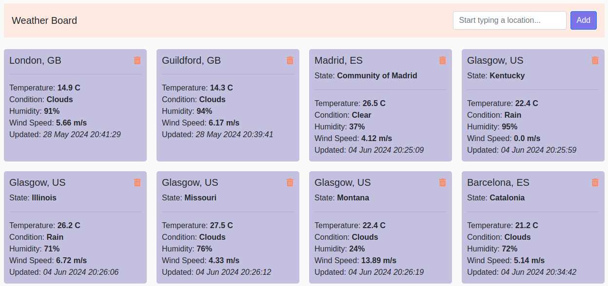

# Weather Board Django App

This repo introduces a simple Django app that utilises OpenWeather API to create a board of weather information of arbitrary locations that a user can manage.

## Available Functionality
### User
- Add a place to get weather data
    - Type a location of interest in the search bar
    - Select the desired option
    - Press the Add button
- Remove a place from the board
    - Press a Rubbish Bin icon on the card corresponding to the location you're looking to remove
- Update the weather details
    - Currently implemented via repeated adding of the place. If the place being added already exists, the weather info will be updated for the existing record and no new place will be added.

### Supporting Functionality
#### Autocomplete 
Suggest locations from entered details and based on the [geo-coding API](https://openweathermap.org/api/geocoding-api) recommendations.

#### Admin console 
Manage the raw backend using an admin account (needs to be set on the server from within the container)

# App Details

## Requirements
- Docker client needs to be installed and running
- .env file in the same directory as the source code
   - sample file with the required params is available at `sample-env-file`

## Build Container & Access the app

1. Once ready, from the code directory run: 
    * `docker compose up`
2. Access the app at 
    * `http://0.0.0.0:8000/`
3. Use `Ctr+C` to stop the container
4. Clean up (remove the container and the image)
   * `docker compose down --rmi all` 

## App Structure
- Backend:
    - Django
    - OpenWeatherAPI
    - SQLite managed by Django
    - PyTest

- Frontend:
    - Django HTML templates
    - Ajax
    - jQuery
    - Bootstrap

## Testing
To run the test, within the container navigate to the `/src` directory and run `python manage.py test`

There is a total of 9 tests as described below:
- Open Weather API - test the API connection and API handling fundtionality, namely OpenWeatherAPI class & data containers
- Backend endpoint testing - test IO for backend endpoints
- Frontend template selection - test that a correct template is executed
- Database management - test that objects are created in and removed from the database as expected

# Future Work

## Technical Improvements
- Frontend: refactor card construction/list management
- Backend: improve the consistency of the naming
   - Currently, location coordinates & autocomplete names are fetched from geo-coding but the final location names used on cards are extracted from the weather API and are obtained via the cords.
   - This often results in slight discrepancies between "what was added" and "what is shown on the card"
   - Solutions: (i) reuse geo-coding names or (ii) have a consistent coord-location mapping
- Backend: standard handler to a response
- Backend: standardised error management
- Add CI/CD

## Additional Functionality
- [Simple] Add a button to update card info in a more convenient way
- [Simple] Make cards look nice, add weather icons
- [Med] Add card-level functionality to generate holiday/things to do ideas
- [Med] Add card-level functionality to gather hottest events
- [Hard] Add card-level functionality to gather sentiment and most popular articles/insta/X posts about the place